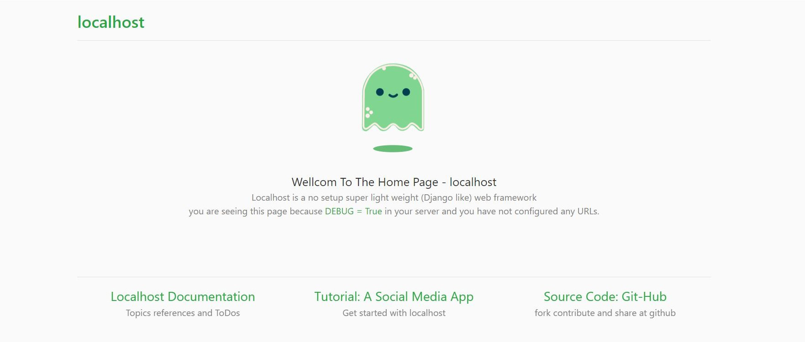

# localhost
A no setup lightweight python web framework -- for localhost

## install
clone this repository to your python import path and run the below hello world script 

```git clone https://github.com/ThakeeNathees/localhost.git```
```python
from localhost import Server
server = Server(port=8000)
server.run()
```
now the server will run at `http://www.localhost:8000/` and you'll see the localhost default home page (for the admin page -> localhost:8000/admin)

## Screenshot
<p align="center">

</p>

## url routing
To add your url paths
```python
from localhost import Server
from localhost.urls import path 
from localhost.response import HttpResponse

server = Server(port=8000)

def home_view(request):
  return HttpResponse('<h1>welcome to the home page!!!</h1>')
  
urlpatterns = [
  path('/home',  home_view, name='home-page')
]

server.urlpatterns = urlpatterns

server.run()
```

## render html
Instead of HttpResponse you can return a rendered html page.
importing localhost create a directory called server_data
```
server_data
  +-- __init__.py
  +-- settings.py
  +-- db/
  |   +-- auth
  |         +-- users.csv
  |         +-- sessions.csv
  +-- static/
  +-- templates/
```

in the settings.py the default path for the templates are specified as  
```TEMPLATE_DIR = os.path.join(SERVER_DATA_DIR, 'templates')```

create your home-page template (home.html) in your TEMPLATE_DIR

```html
{{ html_base_begin }}
<!-- headers, open <body> tag, boostrap style shees --> 

<div class="container" style="margin-top:50px">

 <div class="alert alert-success" role="alert">
  <h4 class="alert-heading">Welcome!!!</h4>
  <p> With localhost using "html_base_begin" and "html_base_end" context you can use boostrap, 
    and a simple html layout, all you have to write here is the body of the page.
  </p>
  <hr>
  {{ replace_me }}
  </div>

</div>

 <!-- close </body> tag, bootstrap javascript files -->
{{ html_base_end }}
```
now replace the HttpResponse with render
```python
from localhost.response import render
def home_view(request):
    return render(request, 'home.html', ctx={
        'replace_me':'<p class="mb-0">you can use context to replace with html source code</p>'
    })
```


